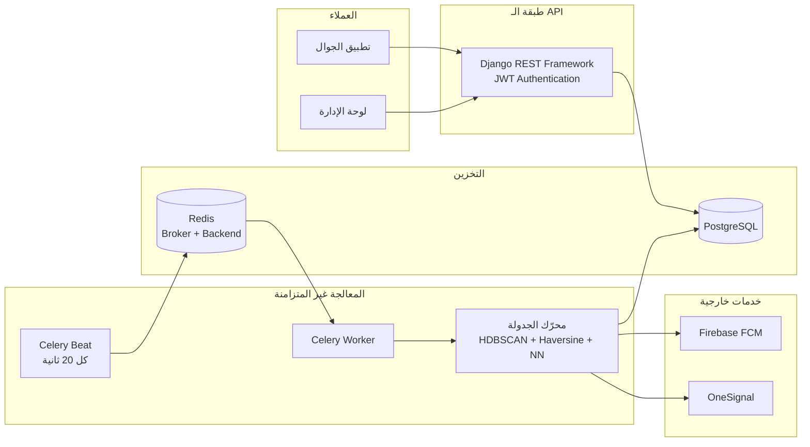
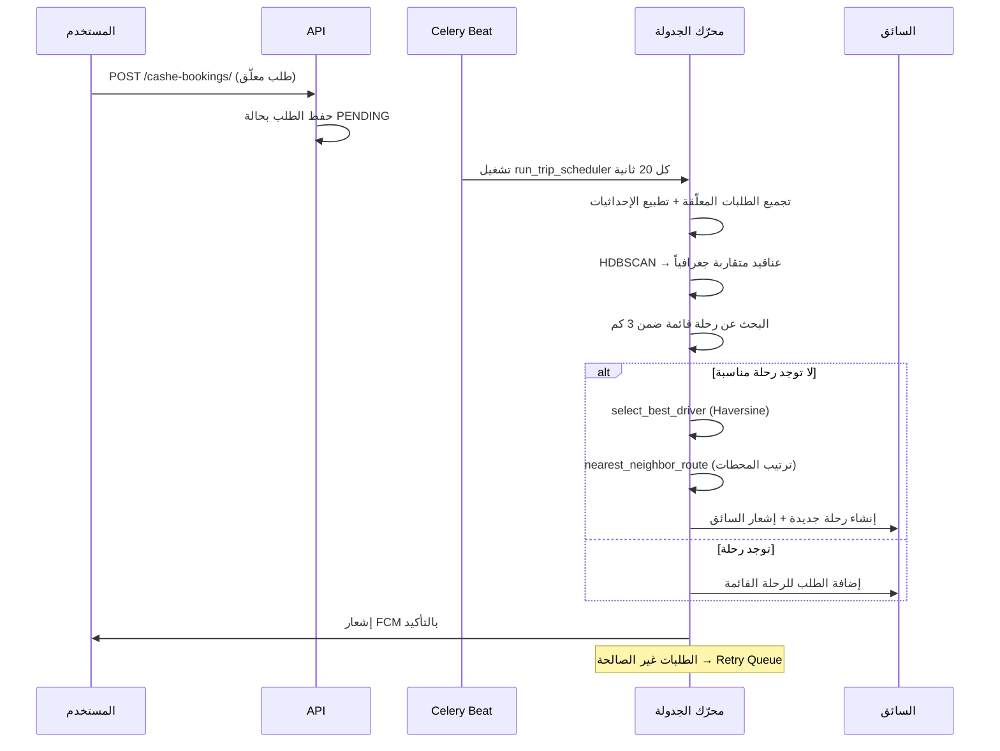
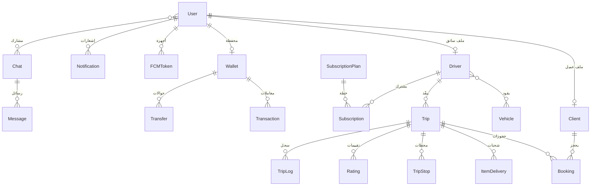

<div align="center">

# 🚐 وِجهتي — Wjhati Backend

**منصّة خلفية (Backend) لنقل الركاب وتوصيل الشحنات مع محرّك جدولة ذكي يجمع الطلبات المتقاربة في رحلات مشتركة.**

[](https://github.com/Al-Nahari/wjhati_django/actions/workflows/django.yml)
[](https://www.python.org/)
[](https://www.djangoproject.com/)
[](https://www.django-rest-framework.org/)
[](https://docs.celeryq.dev/)
[](https://www.postgresql.org/)
[](https://docs.docker.com/compose/)
[](LICENSE)

[نظرة عامة](#-نظرة-عامة) •
[المزايا](#-المزايا-الرئيسية) •
[المعمارية](#-المعمارية) •
[التشغيل](#-التشغيل-السريع) •
[الـ API](#-مرجع-الـ-api) •
[النشر](#-النشر) •
[المساهمة](#-المساهمة)

</div>

---

## 📖 نظرة عامة

**وِجهتي** هو نظام خلفي مبني على **Django REST Framework** يدير دورة حياة كاملة لخدمة نقل مشترك (Ride-Sharing) وتوصيل شحنات (Item Delivery) في آنٍ واحد.

ما يميّز المشروع عن تطبيقات النقل التقليدية هو **محرّك الجدولة الذكي**: بدل انتظار مطابقة فردية بين راكب وسائق، يجمع النظام الطلبات المعلّقة كل ٢٠ ثانية، ويُجمّعها عنقودياً (Clustering) باستخدام **HDBSCAN** بحسب نقاط الانطلاق والوصول، ثم يختار أنسب سائق ويُولّد مساراً مُحسّناً — فتتحول عدة طلبات متفرقة إلى رحلة واحدة مشتركة، ويمكن أن تحمل الرحلة الواحدة **ركاباً وشحنات معاً**.

### لماذا هذا المشروع؟

| التحدي | الحل في «وِجهتي» |
|---|---|
| ارتفاع كلفة الرحلة الفردية | تجميع الطلبات المتقاربة جغرافياً في رحلة واحدة عبر HDBSCAN |
| سائقون فارغون في اتجاه العودة | دمج الركاب مع الشحنات في نفس الرحلة لرفع نسبة الإشغال |
| اختيار عشوائي للسائق | خوارزمية ترشيح تعتمد على مسافة Haversine من موقع السائق إلى كل نقاط الطلب |
| مسار غير فعّال بين المحطات | ترتيب نقاط الالتقاط والإنزال بخوارزمية Nearest Neighbor |
| فقدان الطلبات غير القابلة للمعالجة | قائمة إعادة محاولة (Retry Queue) + إشعار المستخدم بحالة الانتظار |

---

## ✨ المزايا الرئيسية

### 🧠 الجدولة الذكية
- تجميع عنقودي للطلبات المعلّقة عبر **HDBSCAN** بعد تطبيع الإحداثيات بـ `StandardScaler`.
- **دمج هجين**: الرحلة الواحدة تستوعب حجوزات ركاب (`CasheBooking`) وشحنات (`CasheItemDelivery`) معاً.
- **إعادة استخدام الرحلات القائمة**: قبل إنشاء رحلة جديدة يبحث النظام عن رحلة `PENDING/IN_PROGRESS` ضمن نصف قطر 3 كم من نقطتي الانطلاق والوصول.
- **اختيار السائق الأمثل** بحساب متوسط مسافات Haversine لكل طلبات العنقود.
- **تحسين المسار** بترتيب نقاط الالتقاط والإنزال عبر Nearest Neighbor.
- تنفيذ دوري كل **20 ثانية** عبر Celery Beat، مع ضمان ذرّية العمليات داخل `transaction.atomic()`.

### 👥 إدارة المستخدمين والأسطول
- ملفّات **عملاء** (`Client`) و**سائقين** (`Driver`) مرتبطة `OneToOne` بمستخدم Django.
- إدارة **المركبات** مع النوع والسعة وسنة الصنع وتاريخ انتهاء الفحص، وعلاقة `ManyToMany` مع السائقين.
- تقييمات (`Rating`) من 1 إلى 5 مع تحديث تلقائي لمتوسط تقييم السائق وعدّاد رحلاته.

### 🚗 الرحلات والحجوزات
- رحلات بحالات `PENDING / IN_PROGRESS / COMPLETED / CANCELLED`، مع محطات وسيطة (`TripStop`) مرتّبة.
- حجز مقاعد محدّدة عبر حقل `JSONField` يمنع الحجز المزدوج.
- شحنات (`ItemDelivery`) بوزن وقيمة تأمين و**رمز تسليم** فريد للتحقق عند الاستلام.
- سجل تشغيلي (`TripLog`) يوثّق أعداد الطلبات والركاب والأوزان لكل رحلة.

### 💰 المحفظة والمعاملات
- محفظة (`Wallet`) لكل مستخدم بعملة قابلة للضبط وإمكانية التجميد.
- حوالات (`Transfer`) بين المحافظ برمز تحويل فريد.
- سجل معاملات (`Transaction`) بأنواع إيداع/سحب مع `metadata` ورقم مرجعي فريد.
- خطط اشتراك للسائقين (`SubscriptionPlan` / `Subscription`) بعدد رحلات متبقية، ونظام مكافآت (`Bonus`).

### 🔔 الإشعارات والمحادثات
- إشعارات داخل قاعدة البيانات (`Notification`) مصنّفة (حجز / رحلة / دفع / نظام).
- دفع فوري عبر **Firebase Cloud Messaging** بإدارة توكنات متعددة الأجهزة (`FCMToken`)، مع تكامل احتياطي مع **OneSignal**.
- محادثات (`Chat` / `Message`) بين أطراف الرحلة مع دعم المرفقات وحالة القراءة.

### 🎫 الدعم الفني
- تذاكر دعم (`SupportTicket`) بحالة وأولوية وإسناد لموظف.

---

## 🏗 المعمارية



### دورة حياة الطلب



### نموذج البيانات (مبسّط)



---

## 🧰 المكدّس التقني

| الطبقة | التقنية |
|---|---|
| اللغة | Python 3.11+ |
| الإطار | Django 5.1 · Django REST Framework 3.15 |
| المصادقة | SimpleJWT 5.3 (Access / Refresh) |
| قاعدة البيانات | PostgreSQL 17 (`psycopg2-binary`) |
| المهام غير المتزامنة | Celery 5.5 + Celery Beat |
| الوسيط / الكاش | Redis 7 |
| الذكاء والتحليل | scikit-learn · HDBSCAN · NumPy · SciPy |
| الجغرافيا | Haversine مخصّص · geopy |
| الإشعارات | Firebase Admin SDK · OneSignal |
| الخادم | Gunicorn 23 |
| الحاويات | Docker · Docker Compose |
| التكامل المستمر | GitHub Actions |

---

## 🚀 التشغيل السريع

### المتطلبات المسبقة

- Python 3.11+
- PostgreSQL 14+
- Redis 6+
- Docker & Docker Compose (للطريقة الموصى بها)

---

### الطريقة الأولى: Docker Compose ✅ (موصى بها)

```bash
# 1) استنساخ المستودع
git clone https://github.com/Al-Nahari/wjhati_django.git
cd wjhati_django

# 2) تجهيز متغيرات البيئة
cp .env.example .env
# افتح .env واضبط القيم الحقيقية

# 3) تشغيل كامل المنظومة (web + db + redis + worker + beat)
docker compose up --build -d

# 4) الترحيلات وإنشاء مشرف
docker compose exec web python manage.py migrate
docker compose exec web python manage.py createsuperuser

# 5) متابعة السجلات
docker compose logs -f web celery_worker celery_beat
```

| الخدمة | العنوان |
|---|---|
| الـ API | http://localhost:8000/ |
| لوحة الإدارة | http://localhost:8000/admin/ |
| واجهة DRF التصفحية | http://localhost:8000/api-auth/ |

---

### الطريقة الثانية: تثبيت محلي

<details>
<summary><b>📦 الخطوات التفصيلية</b></summary>

```bash
# بيئة افتراضية
python -m venv venv
source venv/bin/activate        # Linux / macOS
venv\Scripts\activate           # Windows

# الاعتماديات
pip install -r requirements.txt
pip install hdbscan             # مطلوب لمحرّك الجدولة (انظر الملاحظات)

# متغيرات البيئة
cp .env.example .env

# قاعدة البيانات
python manage.py makemigrations
python manage.py migrate
python manage.py createsuperuser

# تشغيل الخادم
python manage.py runserver
```

**تشغيل Celery (في نافذتي طرفية منفصلتين):**

```bash
# العامل
celery -A backend worker --loglevel=info          # Linux/macOS
celery -A backend worker --loglevel=info --pool=solo   # Windows

# المجدول
celery -A backend beat --loglevel=info
```

**تثبيت Redis على ويندوز عبر Chocolatey:**

```powershell
Set-ExecutionPolicy Bypass -Scope Process -Force
[System.Net.ServicePointManager]::SecurityProtocol = [System.Net.ServicePointManager]::SecurityProtocol -bor 3072
iex ((New-Object System.Net.WebClient).DownloadString('https://community.chocolatey.org/install.ps1'))

choco install redis-64 -y
net start Redis
```

</details>

---

## ⚙️ متغيرات البيئة

انسخ `.env.example` إلى `.env` واضبط القيم:

| المتغيّر | الوصف | مثال |
|---|---|---|
| `DJANGO_SECRET_KEY` | مفتاح التوقيع السري لـ Django | `supersecretkey` |
| `DJANGO_DEBUG` | وضع التطوير — **اضبطه `False` في الإنتاج** | `True` |
| `DJANGO_ALLOWED_HOSTS` | نطاقات مسموحة مفصولة بفواصل | `api.example.com` |
| `POSTGRES_DB` | اسم قاعدة البيانات | `project_db` |
| `POSTGRES_USER` | مستخدم قاعدة البيانات | `myproject_user` |
| `POSTGRES_PASSWORD` | كلمة المرور | — |
| `POSTGRES_HOST` | مضيف قاعدة البيانات | `db` |
| `POSTGRES_PORT` | المنفذ | `5432` |
| `REDIS_URL` | وسيط Celery ومخزن النتائج | `redis://redis:6379/0` |
| `ONESIGNAL_APP_ID` | معرّف تطبيق OneSignal | — |
| `ONESIGNAL_API_KEY` | مفتاح OneSignal | — |
| `FIREBASE_CREDENTIALS_PATH` | مسار ملف حساب خدمة Firebase على الخادم | `/run/secrets/firebase_admin_sdk.json` |
| `CORS_ALLOWED_ORIGINS` | نطاقات الواجهة الأمامية المسموح لها | `https://app.example.com` |

> ⚠️ **لا ترفع ملف `.env` ولا مفتاح Firebase إلى Git إطلاقاً.** إن تسرّب أي مفتاح سابقاً، أبطِله وولّد بديلاً فوراً من لوحة المزوّد.

---

## 🔌 مرجع الـ API

### المصادقة

يعتمد النظام على **JWT** عبر SimpleJWT. احصل على الرمز ثم أرفقه في ترويسة كل طلب.

```http
POST /api/token/
Content-Type: application/json

{ "username": "user1", "password": "StrongPass123" }
```

```json
{
  "access": "eyJhbGciOiJIUzI1NiIsInR5cCI6IkpXVCJ9...",
  "refresh": "eyJhbGciOiJIUzI1NiIsInR5cCI6IkpXVCJ9..."
}
```

```http
Authorization: Bearer <access_token>
```

| المسار | الطريقة | الوصف |
|---|---|---|
| `/api/register/` | `POST` | تسجيل مستخدم جديد |
| `/api/token/` | `POST` | الحصول على `access` + `refresh` |
| `/api/token/refresh/` | `POST` | تجديد رمز الوصول |
| `/api/save-fcm-token/` | `POST` | حفظ توكن FCM للجهاز |

### الموارد الرئيسية

جميع الموارد التالية مسجّلة عبر `DefaultRouter` وتدعم العمليات القياسية
(`GET` قائمة، `POST` إنشاء، `GET/PUT/PATCH/DELETE` لعنصر عبر `/{id}/`).

| المورد | المسار | الوصف |
|---|---|---|
| المستخدمون | `/user/` | حسابات النظام |
| العملاء | `/clients/` | ملفات العملاء |
| السائقون | `/drivers/` | ملفات السائقين وتوافرهم |
| المركبات | `/vehicles/` | الأسطول |
| الرحلات | `/trips/` | إنشاء وإدارة الرحلات |
| محطات الرحلة | `/trip-stops/` | المحطات الوسيطة المرتّبة |
| الحجوزات | `/bookings/` | حجز مقاعد ضمن رحلة قائمة |
| الشحنات | `/item-deliveries/` | شحنات مرتبطة برحلة |
| طلبات الحجز المعلّقة | `/cashe-bookings/` | مدخلات محرّك الجدولة (ركاب) |
| طلبات الشحن المعلّقة | `/cashe-item-deliveries/` | مدخلات محرّك الجدولة (شحنات) |
| التقييمات | `/ratings/` | تقييم السائق بعد الرحلة |
| المحافظ | `/wallets/` | قراءة فقط |
| المعاملات | `/transactions/` | قراءة فقط |
| الحوالات | `/transfers/` | إنشاء وقراءة |
| خطط الاشتراك | `/subscription-plans/` | الخطط المتاحة |
| الاشتراكات | `/subscriptions/` | اشتراكات السائقين |
| المكافآت | `/bonuses/` | مكافآت المستخدمين |
| الإشعارات | `/notifications/` | قائمة وتعليم كمقروء |
| تذاكر الدعم | `/support-tickets/` | الدعم الفني |

### المحادثات

| المسار | الطريقة | الوصف |
|---|---|---|
| `/chats/` | `GET` | محادثات المستخدم الحالي |
| `/chats/{chat_id}/messages/` | `GET` | رسائل محادثة |
| `/chats/{chat_id}/messages/send/` | `POST` | إرسال رسالة (يدعم المرفقات) |

<details>
<summary><b>💡 أمثلة عملية</b></summary>

**إنشاء طلب حجز معلّق (سيلتقطه محرّك الجدولة):**

```bash
curl -X POST http://localhost:8000/cashe-bookings/ \
  -H "Authorization: Bearer $ACCESS" \
  -H "Content-Type: application/json" \
  -d '{
    "from_location": "15.3694,44.1910",
    "to_location":   "15.5527,48.5164",
    "departure_time": "2026-10-01T08:00:00Z",
    "passengers": 2,
    "notes": "بجانب النافذة"
  }'
```

> 📍 حقول المواقع تُخزَّن كنص بصيغة `"latitude,longitude"` — وهذا ما تعتمد عليه حسابات Haversine والتجميع العنقودي.

**حفظ توكن FCM:**

```bash
curl -X POST http://localhost:8000/api/save-fcm-token/ \
  -H "Authorization: Bearer $ACCESS" \
  -H "Content-Type: application/json" \
  -d '{"token": "fcm_device_token_here", "device_info": {"os": "android", "model": "Pixel 8"}}'
```

</details>

---

## 🧠 محرّك الجدولة الذكي

```
apis/management/commands/dbscan_clustering.py   ← الأمر الرئيسي
apis/driver_selector.py                          ← اختيار السائق الأمثل (Haversine)
apis/route_optimizer.py                          ← ترتيب المسار (Nearest Neighbor)
apis/retry_queue.py                              ← إعادة محاولة الطلبات المتعثّرة
apis/tasks.py                                    ← مهمة Celery: run_trip_scheduler
```

**خطوات الخوارزمية:**

1. **الجمع** — قراءة كل `CasheBooking` و`CasheItemDelivery` بحالة `PENDING`.
2. **الاستخراج** — تحويل `from_location` و`to_location` إلى متجه رباعي `[lat₁, lon₁, lat₂, lon₂]`؛ الطلبات ذات الإحداثيات الفاسدة تُحوَّل إلى قائمة إعادة المحاولة.
3. **التطبيع** — `StandardScaler` لتوحيد مقياس الأبعاد.
4. **التجميع** — `HDBSCAN(min_cluster_size=N)` لإنتاج العناقيد. إذا لم يكفِ عدد الطلبات، تُعالَج فردياً مع إشعار «طلبك قيد الانتظار».
5. **المطابقة** — البحث عن رحلة قائمة ضمن **3 كم** من نقطتي الانطلاق والوصول وبمقاعد كافية.
6. **الترشيح** — عند عدم وجود رحلة، يُختار السائق المتاح الأقرب بمتوسط مسافات Haversine.
7. **التحسين** — ترتيب نقاط الالتقاط والإنزال عبر Nearest Neighbor.
8. **الإنشاء** — رحلة جديدة داخل `transaction.atomic()`، تعليم السائق كغير متاح، وإرسال الإشعارات عبر `transaction.on_commit`.

**تشغيل يدوي للاختبار:**

```bash
python manage.py dbscan_clustering --min_cluster_size=3
```

> ⚠️ الخيار `--loop` مخصّص للتشغيل اليدوي خارج Celery فقط. لا تستخدمه مع Celery Beat وإلا تراكمت العمليات وأُغرق العامل.

---

## 🧪 الاختبارات

```bash
# محلياً
python manage.py test

# داخل Docker
docker compose exec web python manage.py test

# تطبيق محدّد
python manage.py test apis
```

يغطي `apis/tests.py` سيناريوهات إنشاء العملاء والسائقين والمركبات والرحلات والحجوزات والتقييمات والاشتراكات على مستوى النماذج.

### التكامل المستمر

يعمل سير `.github/workflows/django.yml` على كل `push` و`pull request` إلى `main`: تثبيت الاعتماديات ثم تشغيل مجموعة الاختبارات.

---

## 📦 النشر

### Docker (الإنتاج)

```bash
docker compose -f docker-compose.yml up -d --build
```

حدّث `command` لخدمة `web` إلى Gunicorn بدل `runserver`:

```yaml
command: ./start.sh gunicorn backend.wsgi:application --bind 0.0.0.0:8000 --workers 4
```

يتولّى `start.sh` تنفيذ `migrate` و`collectstatic` قبل إقلاع الخادم.

### Render

يحوي المستودع `render.yaml` جاهزاً. **قبل النشر:**

- اضبط كل الأسرار من لوحة Render بخاصية `sync: false` — لا تكتبها في الملف.
- راجع `rootDir` وأزل السطر إن كان `manage.py` في جذر المستودع.
- وحّد أسماء متغيرات قاعدة البيانات مع ما يقرأه `settings.py` (`POSTGRES_*`).

### قائمة تحقق قبل الإنتاج

- [ ] `DJANGO_DEBUG=False`
- [ ] `DJANGO_ALLOWED_HOSTS` بنطاقات حقيقية لا `*`
- [ ] `DJANGO_SECRET_KEY` قوي ومولّد عشوائياً
- [ ] `CORS_ALLOWED_ORIGINS` محدّد صراحةً (وليس السماح للجميع)
- [ ] HTTPS مفعّل مع `SECURE_SSL_REDIRECT` و`SESSION_COOKIE_SECURE`
- [ ] نسخ احتياطي دوري لقاعدة البيانات
- [ ] Redis محمي بكلمة مرور وغير مكشوف للإنترنت
- [ ] مراقبة سجلات Celery Worker و Beat
- [ ] ملف Firebase مُمرَّر كـ Docker Secret لا كملف داخل المستودع

---

## 📁 بنية المشروع

```
wjhati_django/
├── backend/                     # إعدادات المشروع
│   ├── settings.py              # الإعدادات + Celery + DRF + CORS
│   ├── celery.py                # تهيئة Celery
│   ├── urls.py                  # المسارات الجذرية (Auth · Chats)
│   ├── asgi.py · wsgi.py
│
├── apis/                        # التطبيق الأساسي
│   ├── models.py                # Client · Driver · Vehicle · Trip · Booking · ItemDelivery …
│   ├── views.py                 # ViewSets و APIViews
│   ├── serializers.py           # المُسلسِلات
│   ├── urls.py                  # DefaultRouter
│   ├── permissions.py           # IsStaffOrReadOnly · IsDriverOrStaffOrReadOnly
│   ├── admin.py · signals.py
│   ├── tasks.py                 # مهام Celery
│   ├── driver_selector.py       # اختيار السائق الأمثل
│   ├── route_optimizer.py       # تحسين المسار
│   ├── retry_queue.py           # إعادة المحاولة
│   ├── firebase.py · onesignal.py
│   ├── tests.py
│   └── management/commands/
│       └── dbscan_clustering.py # محرّك الجدولة
│
├── Transaction/                 # المحافظ والحوالات والمعاملات
├── Notification/                # الإشعارات وتوكنات FCM
├── static/                      # الملفات الثابتة المجمّعة
│
├── .github/workflows/django.yml # التكامل المستمر
├── docker-compose.yml           # web · db · redis · worker · beat
├── Dockerfile
├── render.yaml
├── start.sh
├── requirements.txt
└── .env.example
```

---

## 🔐 ملاحظات أمنية

- **الأسرار**: لا تُدرج أي مفتاح أو كلمة مرور في المستودع. أي سرّ سبق رفعه يُعتبر مخترقاً ويجب تدويره فوراً.
- **CORS**: يسمح `settings.py` بكل النطاقات فقط إن كان `CORS_ALLOWED_ORIGINS` فارغاً، وفي هذه الحالة يُعطّل إرسال بيانات الاعتماد عمداً. اضبط النطاقات في الإنتاج.
- **Firebase**: مرّر ملف حساب الخدمة عبر `FIREBASE_CREDENTIALS_PATH` من مسار سرّي على الخادم.
- **الصلاحيات**: الكتابة على الموارد الحسّاسة محصورة بالمشرفين أو السائقين عبر أصناف الصلاحيات المخصّصة.
- **JWT**: قصّر عمر رمز الوصول وفعّل تدوير رموز التجديد في الإنتاج.

---

## ⚠️ ملاحظات معروفة

| الملاحظة | الإجراء المقترح |
|---|---|
| `hdbscan` مستخدم في محرّك الجدولة لكنه غير مدرج في `requirements.txt` | أضف `hdbscan` إلى ملف الاعتماديات |
| مصفوفة CI تستخدم Python 3.8/3.9 بينما Django 5.1 يتطلب 3.10+ | حدّث `python-version` في سير العمل إلى `["3.11", "3.12"]` |
| `django-jazzmin` مثبّت لكنه غير مضاف إلى `INSTALLED_APPS` | أضفه للتفعيل أو احذفه من الاعتماديات |
| ملفات `celerybeat-schedule.*` مرفوعة إلى Git | أضفها إلى `.gitignore` |
| `render.yaml` يستخدم `DB_*` بينما `settings.py` يقرأ `POSTGRES_*` | وحّد التسمية بين الملفين |
| لا يوجد توثيق OpenAPI تفاعلي | أضف `drf-spectacular` لتوليد Swagger/Redoc |

---

## 🗺 خارطة الطريق

- [ ] توثيق OpenAPI تفاعلي عبر `drf-spectacular`
- [ ] تتبّع الموقع اللحظي للسائق عبر Django Channels (WebSocket)
- [ ] تكامل بوابات دفع محلية
- [ ] تحويل حقول المواقع إلى `PointField` مع PostGIS
- [ ] تسعير ديناميكي بحسب المسافة والطلب
- [ ] رفع تغطية الاختبارات وإضافة اختبارات تكامل للـ API
- [ ] لوحة تحليلات لأداء الأسطول ونسب الإشغال
- [ ] تعدّد اللغات (عربي / إنجليزي) في استجابات الـ API

---

## 🤝 المساهمة

المساهمات مرحّب بها. الخطوات:

1. اعمل Fork للمستودع.
2. أنشئ فرعاً: `git checkout -b feature/amazing-feature`.
3. التزم بالتغييرات: `git commit -m "feat: add amazing feature"`.
4. ادفع الفرع: `git push origin feature/amazing-feature`.
5. افتح Pull Request مع وصف واضح.

**إرشادات:**

- اتبع [Conventional Commits](https://www.conventionalcommits.org/) (`feat:` · `fix:` · `docs:` · `refactor:` · `test:`).
- التزم بمعيار PEP 8 وشغّل الاختبارات قبل فتح الطلب.
- أضف اختباراً لكل ميزة أو إصلاح جديد.
- لا ترفع أي أسرار أو ملفات بيئة.

---

## 📄 الرخصة

هذا المشروع مرخّص تحت رخصة **MIT** — راجع ملف [LICENSE](LICENSE) للتفاصيل.

---

## 👤 المطوّر

**Al-Nahari**

[](https://github.com/Al-Nahari)

للأسئلة والاقتراحات، افتح [Issue](https://github.com/Al-Nahari/wjhati_django/issues) في المستودع.

---

<div align="center">

**⭐ إذا أعجبك المشروع، لا تنسَ إعطاءه نجمة!**

صُنع بـ ❤️ باستخدام Django

</div>
